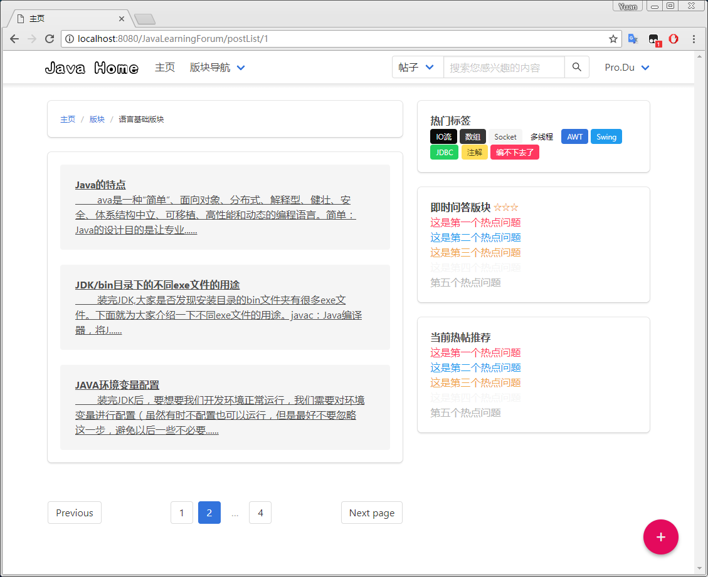
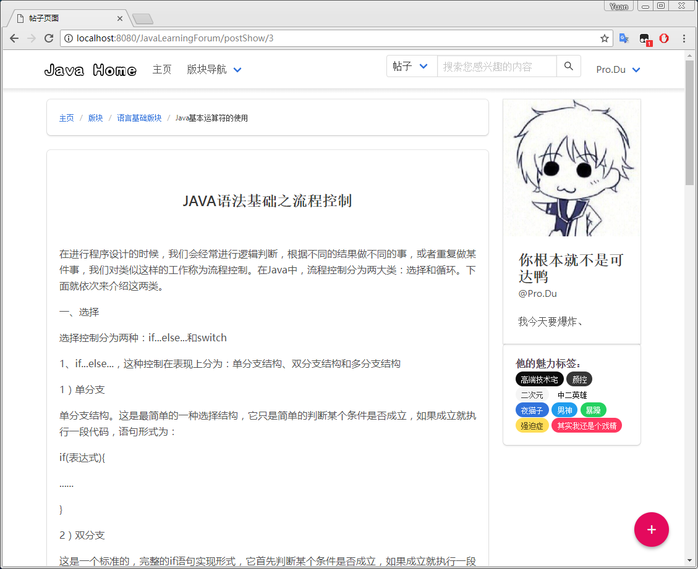
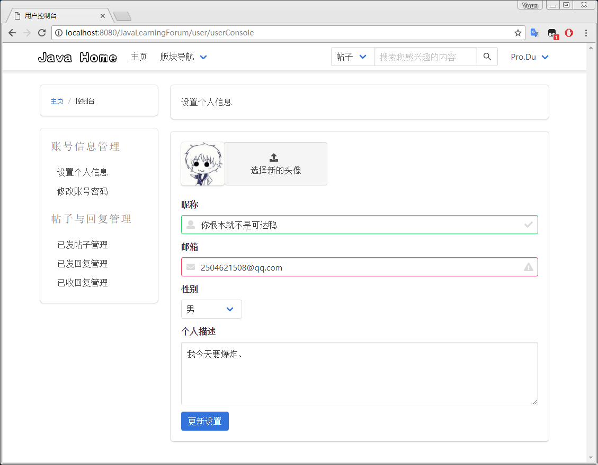

# Pure-Java-Learning-Forum
这是一个纯粹的Java语言的学习论坛。前端基于Bulma框架，后端实现基于SSM框架。其中还引用了许多其他优秀的插件。
---
## 项目说明
Pure-Java-Learning-Forum 是用SpringMVC、Spring、MyBatis作为后端框架，开发的一个Java学习论坛，其具有以下特点：
* 轻量级css框架，界面能够自适应
* 基本的论坛发帖回帖功能
* 更多特性等待开发和探索

## 项目组件
####前端相关：
* BULMA  <http://bulma.io/>
* summernote  <https://summernote.org>
* material-floating-button  <https://github.com/nobitagit/material-floating-button>
* layui  <http://www.layui.com>
* ionicons  <http://ionicons.com/>

####后端相关：

## 预览图
**用户界面：**
* 首页 

* 帖子列表 

* 帖子

* 用户控制台 
